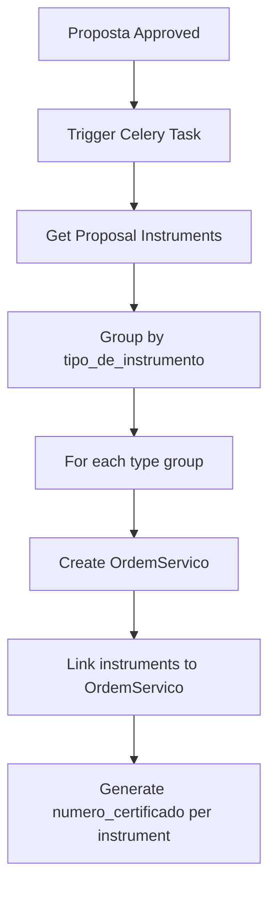

# OrdemServico Auto-Generation on Proposal Approval

## Overview

When a Proposta status changes to "A" (Aprovada), automatically create `OrdemServico` records grouped by instrument type, and generate certificate numbers for each instrument.

## Data Flow



## Implementation Steps

### 1. Create New Django App `ordem_servico`

Location: `bef-backend/app/ordem_servico/`

```bash
cd bef-backend/app && python manage.py startapp ordem_servico
```

Add to `INSTALLED_APPS` in `rkp_platform/settings.py`.

### 2. Create OrdemServico Model

File: `ordem_servico/models.py`

```python
class OrdemServico(models.Model):
    proposta = models.ForeignKey(
        "propostas.Proposta",
        on_delete=models.CASCADE,
        related_name="ordens_servico"
    )
    responsavel = models.ForeignKey(
        User,
        on_delete=models.SET_NULL,
        null=True,
        blank=True,
        related_name="ordens_servico"
    )
    instrumentos = models.ManyToManyField(
        "instrumentos.InstrumentoDoCliente",
        related_name="ordens_servico"
    )
    data_expiracao = models.DateField(null=True, blank=True)
    numero = models.CharField(max_length=25, unique=True)
    data_criacao = models.DateTimeField(auto_now_add=True)
```

**Numero generation logic**: `{proposta.numero}-OS{sequence}`

- Example: Proposta `0015A26` with 3 types → `0015A26-OS1`, `0015A26-OS2`, `0015A26-OS3`

### 3. Add `numero_certificado` to InstrumentoDoCliente

File: `instrumentos/models.py` (add new field)

```python
numero_certificado = models.CharField(
    max_length=30,
    null=True,
    blank=True,
    verbose_name="Número do certificado"
)
```

**Generation logic**: `{ordem_servico.numero}-{sequence:03d}`

- Example: OrdemServico `0015A26-OS1` with 3 instruments → `0015A26-OS1-001`, `0015A26-OS1-002`, `0015A26-OS1-003`

### 4. Create Celery Task

File: `ordem_servico/tasks.py`

```python
@shared_task
def criar_ordens_servico_proposta(proposta_id):
    proposta = Proposta.objects.get(id=proposta_id)
    instrumentos = proposta.instrumentos.select_related(
        'instrumento__tipo_de_instrumento'
    ).all()
    
    # Group by tipo_de_instrumento
    grupos = defaultdict(list)
    for inst in instrumentos:
        tipo_id = inst.instrumento.tipo_de_instrumento_id
        grupos[tipo_id].append(inst)
    
    # Create OrdemServico for each group
    for seq, (tipo_id, insts) in enumerate(grupos.items(), start=1):
        numero = f"{proposta.numero}-OS{seq}"
        ordem = OrdemServico.objects.create(
            proposta=proposta,
            numero=numero
        )
        ordem.instrumentos.set(insts)
        
        # Generate numero_certificado for each instrument
        for cert_seq, inst in enumerate(insts, start=1):
            inst.numero_certificado = f"{numero}-{cert_seq:03d}"
            inst.save(update_fields=['numero_certificado'])
```

### 5. Trigger Task on Approval

File: `propostas/views.py` - Modify `aprovar` action

```python
@action(detail=True, methods=["POST"], permission_classes=[IsAuthenticated])
def aprovar(self, request, pk=None):
    proposta = self.get_object()
    proposta.status = "A"
    proposta.data_aprovacao = date.today()
    proposta.save()
    
    # Trigger OrdemServico creation task
    from ordem_servico.tasks import criar_ordens_servico_proposta
    criar_ordens_servico_proposta.delay(proposta.id)
    
    # ... rest of existing logic
```

### 6. Create Serializers

File: `ordem_servico/serializers.py`

```python
from rest_framework import serializers
from .models import OrdemServico

class OrdemServicoSerializer(serializers.ModelSerializer):
    proposta_numero = serializers.CharField(source='proposta.numero', read_only=True)
    cliente_nome = serializers.CharField(source='proposta.cliente.empresa', read_only=True)
    responsavel_nome = serializers.CharField(source='responsavel.first_name', read_only=True)
    instrumentos_count = serializers.IntegerField(source='instrumentos.count', read_only=True)
    
    class Meta:
        model = OrdemServico
        fields = [
            'id', 'numero', 'proposta', 'proposta_numero', 'cliente_nome',
            'responsavel', 'responsavel_nome', 'data_expiracao', 'data_criacao',
            'instrumentos', 'instrumentos_count'
        ]
        read_only_fields = ['id', 'numero', 'proposta', 'data_criacao', 'instrumentos']


class OrdemServicoDetailSerializer(OrdemServicoSerializer):
    """Includes full instrument details for expanded view"""
    instrumentos = InstrumentoDoClienteSerializer(many=True, read_only=True)
```

### 7. Create ViewSet and API Endpoints

File: `ordem_servico/views.py`

```python
from rest_framework import viewsets, status
from rest_framework.decorators import action
from rest_framework.response import Response
from rest_framework.permissions import IsAuthenticated
from .models import OrdemServico
from .serializers import OrdemServicoSerializer, OrdemServicoDetailSerializer

class OrdemServicoViewSet(viewsets.ModelViewSet):
    queryset = OrdemServico.objects.all()
    serializer_class = OrdemServicoSerializer
    permission_classes = [IsAuthenticated]
    
    def get_queryset(self):
        queryset = OrdemServico.objects.select_related(
            'proposta__cliente', 'responsavel'
        ).prefetch_related('instrumentos')
        
        # Filter by responsavel if provided
        responsavel_id = self.request.query_params.get('responsavel')
        if responsavel_id:
            queryset = queryset.filter(responsavel_id=responsavel_id)
        
        return queryset.order_by('-data_criacao')
    
    def get_serializer_class(self):
        if self.action == 'retrieve':
            return OrdemServicoDetailSerializer
        return OrdemServicoSerializer
    
    @action(detail=False, methods=['GET'])
    def minhas(self, request):
        """Get OS assigned to current user"""
        if not request.user.is_staff:
            return Response(
                {"detail": "Acesso negado"},
                status=status.HTTP_403_FORBIDDEN
            )
        
        limit = request.query_params.get('limit')
        queryset = self.get_queryset().filter(responsavel=request.user)
        
        if limit:
            queryset = queryset[:int(limit)]
        
        serializer = self.get_serializer(queryset, many=True)
        return Response(serializer.data)
    
    def update(self, request, *args, **kwargs):
        """Only gerente can update OS"""
        if not request.user.groups.filter(name='gerente').exists():
            return Response(
                {"detail": "Apenas gerentes podem editar ordens de serviço"},
                status=status.HTTP_403_FORBIDDEN
            )
        return super().update(request, *args, **kwargs)
    
    def partial_update(self, request, *args, **kwargs):
        """Only gerente can update OS"""
        if not request.user.groups.filter(name='gerente').exists():
            return Response(
                {"detail": "Apenas gerentes podem editar ordens de serviço"},
                status=status.HTTP_403_FORBIDDEN
            )
        return super().partial_update(request, *args, **kwargs)
```

### 8. Register URLs

File: `ordem_servico/urls.py`

```python
from rest_framework.routers import DefaultRouter
from .views import OrdemServicoViewSet

router = DefaultRouter()
router.register(r'ordens-servico', OrdemServicoViewSet, basename='ordem-servico')

urlpatterns = router.urls
```

File: `rkp_platform/urls.py` - Add include

```python
urlpatterns = [
    # ... existing paths
    path('api/', include('ordem_servico.urls')),
]
```

### 9. Register in Admin

File: `ordem_servico/admin.py`

```python
from django.contrib import admin
from .models import OrdemServico

@admin.register(OrdemServico)
class OrdemServicoAdmin(admin.ModelAdmin):
    list_display = ['numero', 'proposta', 'responsavel', 'data_expiracao', 'data_criacao']
    list_filter = ['responsavel', 'data_expiracao']
    search_fields = ['numero', 'proposta__numero']
    raw_id_fields = ['proposta', 'responsavel']
    filter_horizontal = ['instrumentos']
```

### 11. Create Migration

```bash
python manage.py makemigrations ordem_servico instrumentos
python manage.py migrate
```

---

## API Endpoints (Frontend Integration)

| Method | Endpoint | Description | Permission | Used By |
|--------|----------|-------------|------------|---------|
| `GET` | `/api/ordens-servico/` | List all OS | Staff | Admin views |
| `GET` | `/api/ordens-servico/?responsavel={id}` | List OS by responsavel | Staff | Team Member Detail |
| `GET` | `/api/ordens-servico/{id}/` | Get OS detail with instruments | Staff | OS Detail view |
| `GET` | `/api/ordens-servico/minhas/` | Get current user's OS | Staff | My OS Page (`/eu`) |
| `GET` | `/api/ordens-servico/minhas/?limit=5` | Get last 5 OS for user | Staff | Dashboard Widget |
| `PATCH` | `/api/ordens-servico/{id}/` | Update OS (responsavel, data_expiracao) | Gerente | Edit OS Dialog |

### Request/Response Examples

#### GET /api/ordens-servico/minhas/

**Response:**
```json
[
  {
    "id": 1,
    "numero": "0015A26-OS1",
    "proposta": 15,
    "proposta_numero": "0015A26",
    "cliente_nome": "Empresa ABC",
    "responsavel": 5,
    "responsavel_nome": "João Silva",
    "data_expiracao": "2026-02-15",
    "data_criacao": "2026-01-08T10:30:00Z",
    "instrumentos_count": 3
  }
]
```

#### PATCH /api/ordens-servico/{id}/

**Request:**
```json
{
  "responsavel": 7,
  "data_expiracao": "2026-03-01"
}
```

**Response:**
```json
{
  "id": 1,
  "numero": "0015A26-OS1",
  "responsavel": 7,
  "responsavel_nome": "Maria Santos",
  "data_expiracao": "2026-03-01",
  ...
}
```

---

## Files to Create/Modify

| Action | File | Purpose |
|--------|------|---------|
| Create | `ordem_servico/__init__.py` | Package init |
| Create | `ordem_servico/models.py` | OrdemServico model |
| Create | `ordem_servico/serializers.py` | DRF serializers |
| Create | `ordem_servico/views.py` | ViewSet with actions |
| Create | `ordem_servico/urls.py` | API routes |
| Create | `ordem_servico/tasks.py` | Celery task |
| Create | `ordem_servico/admin.py` | Django admin |
| Create | `ordem_servico/apps.py` | App config |
| Modify | `rkp_platform/settings.py` | Add to INSTALLED_APPS |
| Modify | `rkp_platform/urls.py` | Include ordem_servico.urls |
| Modify | `instrumentos/models.py` | Add numero_certificado field |
| Modify | `propostas/views.py` | Trigger task in aprovar |

## Example Scenario

Proposta `0015A26` with 9 instruments:

- 3x Termômetro (TipoInstrumento id=1)
- 3x Manômetro (TipoInstrumento id=2)  
- 3x Balança (TipoInstrumento id=3)

**Result:**

| OrdemServico | Instruments | Certificate Numbers |
|--------------|-------------|---------------------|
| 0015A26-OS1 | Termômetro A, B, C | 0015A26-OS1-001, -002, -003 |
| 0015A26-OS2 | Manômetro A, B, C | 0015A26-OS2-001, -002, -003 |
| 0015A26-OS3 | Balança A, B, C | 0015A26-OS3-001, -002, -003 |

---

## Related Frontend Features

This backend feature supports the following frontend pages:

| Frontend Feature | Route | Backend Endpoints Used |
|------------------|-------|------------------------|
| Team Members List | `/admin/equipe` | `GET /users/?is_staff=true` |
| Team Member Detail | `/admin/equipe/:userId` | `GET /ordens-servico/?responsavel={id}`, `PATCH /ordens-servico/{id}/` |
| My OS Page | `/eu` | `GET /ordens-servico/minhas/` |
| Dashboard OS Widget | `/admin/app` | `GET /ordens-servico/minhas/?limit=5` |

See documentation:
- `docs/features/frontend/equipe/team-list/plan.md`
- `docs/features/frontend/equipe/team-member-detail/plan.md`
- `docs/features/frontend/equipe/my-os-page/plan.md`
- `docs/features/frontend/equipe/dashboard-os-widget/plan.md`